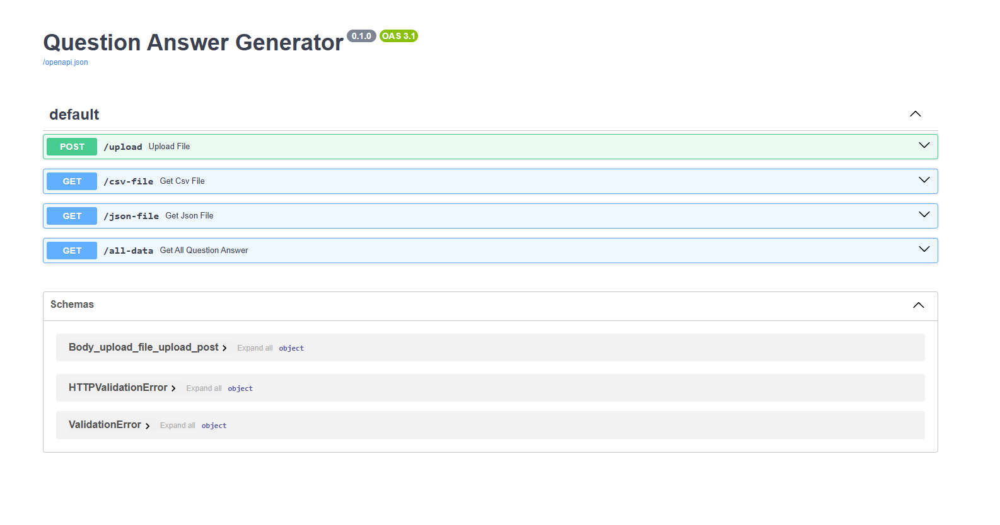

# 📚 PDF to Q&A Generator

This project is a **End to End Question Answer Generator (RAG) System** built with **FastAPI**, **Next.js**, **LangChain**, **OpenAI embeddings**, and **FAISS**.  
It extracts text from PDFs, converts the text into semantic embeddings, and uses Retrieval-Augmented Generation (RAG) to generate accurate question–answer pairs. Users can query the system, and answers are retrieved based on the most relevant document context.
---

## 🌟 Features
- **PDF Text Extraction**: Uses PyPDFLoader to extract text from PDFs
- **Semantic Search**: Leverages OpenAI embeddings and FAISS vector database for accurate document retrieval
- **Question–Answer Generation**: Generates unique and meaningful question–answer pairs from documents using Retrieval-Augmented Generation (RAG).
- **REST API**: Built with FastAPI for easy integration into other systems or applications.
- **Web Interface**: Next.js frontend for intuitive interaction with document Q&A
- **CSV/JSON Export**: Download generated Q&A pairs in structured formats for analysis or reuse.
- **Scalable & Modular**: Easily extendable for larger datasets, multiple documents, or different embedding models.
- **Loading State & Alerts**: Smooth UX with loaders, success alerts, and error handling in the frontend.


## 🛠️ Tech Stack
- **Backend**: FastAPI (REST API for Q&A generation and document retrieval)  
- **Data Extraction**: PyPDFLoader (PDF text extraction, including scanned docs)  
- **AI/ML**: LangChain, OpenAI API, Sentence-Transformers, Groq (for LLM inference)  
- **Vector Database**: FAISS (semantic search & retrieval)  
- **Frontend**: Next.js, TailwindCSS (user-friendly web interface)  
- **Environment**: Python 3.11.13


## **Setup Guide (Windows Command Prompt)*

### **Step 1:** Clone the Repository
```bash
git clone https://github.com/hannan70/end-to-end-question-answer-generator.git

cd end-to-end-question-answer-generator
```


## ⚙️ Backend Setup (FastAPI)
```bash
cd backend 
````
### **Step 1:** Create Virtual Environment
```bash
conda create -p venv python==3.11.13 (version: Python 3.11.13)
```

### **Step 2:** Activate Environment
```bash
conda activate venv\
```

### **Step 3:** Create .env File
```bash
Create a .env file in the project root and add:

GROQ_API_KEY="******************"
OPENAI_API_KEY="******************"
```

### **Step 4:** Install Packages
```bash
pip install -r requirements.txt
```
 
### **Step 5:** Run FastAPI (for API)
```bash
uvicorn app:app --reload
API will run at: http://127.0.0.1:8000/docs
```

## 🎨 Frontend Setup (Next.js)
```BASH
cd frontend
```
```BASH
npm install
```
```BASH
npm run dev
```


## 📋 Dependencies
 
- **FastAPI** – Web framework for building the API endpoints.
- **LangChain** – Framework for Retrieval-Augmented Generation (RAG).
- **LangChain-OpenAI** – Integrates OpenAI models for embeddings and LLM tasks.
- **LangChain-Groq** – Supports Groq models for LLM inference.
- **LangChain-HuggingFace** – HuggingFace embeddings integration.
- **FAISS** – Vector database for fast semantic search and similarity queries.
- **pypdf / PyPDFLoader** – Extracts text from PDF files.
- **sentence-transformers** – Generates embeddings from text.
- **python-dotenv** – Loads environment variables from .env file.
- **uvicorn** – ASGI server for running FastAPI apps.
- **python-multipart / aiofiles** – Supports file uploads in FastAPI.
- **numpy / pandas** – Data manipulation and processing.
- **ipykernel** – Development environment support (Jupyter, debugging, etc.).


## 📖 Sample Queries  

### **Question 01:**  
```bash
Question: What is Machine Learning and its main function?

Answer: Machine Learning is a branch of AI that enables systems to learn from data and improve automatically.
```

### **Question 02:**  
```bash
Question: What is the primary focus of the Deep Learning subfield?

Answer: Deep Learning is a subfield of Machine Learning that uses neural networks with many layers to model complex patterns in large datasets.
```

### **Question 03:**  
```bash
Question:What tasks does Deep Learning find particularly useful?

Answer: Deep Learning is particularly useful in tasks like image recognition, speech processing, and autonomous driving.
```
 
## 📄 API Documentation
```bash
Swagger documentation is available at: http://127.0.0.1:8000/docs
```


 
## 📄 API Documentation


## 🏗️ System Architecture

### **1. Text Extraction**
- **Primary Tool**: PyPDFLoader
- **Workflow**: PDF → PyPDFLoader → Extracted Text
- **Strengths**: Accurately captures text from both scanned documents and complex layouts, ensuring minimal data loss during extraction.

### **2. Chunking & Context Preservation**
- **Tool**: LangChain's RecursiveCharacterTextSplitter
- **Approach**: Character-based chunking while maintaining semantic boundaries
- **Benefits**: Ensures contextual integrity of text chunks, enabling more precise embeddings and retrieval.

### **3. Embedding & Retrieval**
- **Embedding Model**: OpenAI’s `text-embedding-3-large`
- **Vector Store**: FAISS
- **Similarity Metric**: Cosine similarity for semantic matching
- **Advantages**: Fast, scalable, and high-quality semantic retrieval for accurate question-answer generation.

---

## 📝 License

This project is **open-source** and built with ❤️ using **LangChain**, **OpenAI**, **FAISS**, and modern **NLP techniques**.  
Feel free to use, modify, and distribute under the terms of the MIT License.